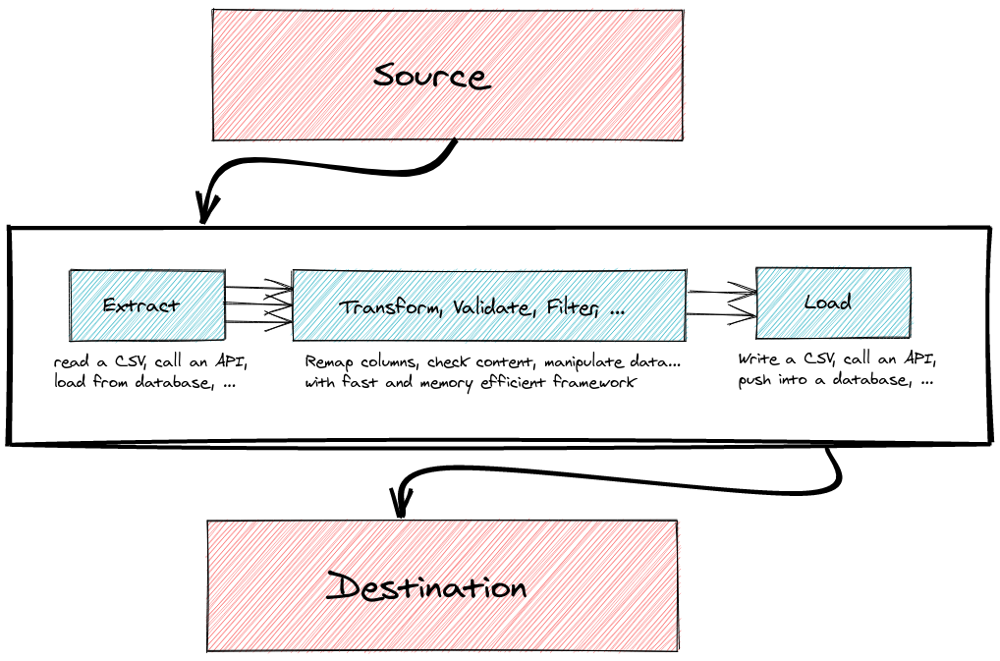

Quick start
===========

## Base concepts

In most applications, there's always a set of workflows defining how to manage your data. It can be imports/exports,
asynchronous treatments or periodically checking an API... Over time these workflows grow, and code may duplicate
quite quickly.

This bundle aims to provide a framework to build efficient, quick to build, easy to change workflows.

Its main concept is the *process*: it's a set of *tasks* chained together according to the workflow you want
to define. Each *task* has the duty to perform one simple action on each piece of *data* provided.

The most common example is the ETL. It's a kind of application whose main purpose is to
- *Extract* a chunk of data from a source (database, file, API, ...)
- *Transform* this data into something else (modify the values, change the format, compute some statistics, ...)
- *Load* the transformed data into a destination (another database, file, API, ...)



## Installation

Make sure Composer is installed globally, as explained in the [installation chapter](https://getcomposer.org/doc/00-intro.md)
of the Composer documentation.

Open a command console, enter your project directory and install it using composer:

```bash
composer require cleverage/process-bundle
```

Remember to add the following line to `config/bundles.php` (not required if Symfony Flex is used):

```php
CleverAge\ProcessBundle\CleverAgeProcessBundle::class => ['all' => true],
```

Some tasks and transformers use the main Symfony serializer service, and the bundle checks at container compilation
that it is available: if it is not, the build fails with an explicit message. Make sure it is enabled
(see [`framework.serializer.enabled`](https://symfony.com/doc/current/reference/configuration/framework.html#reference-serializer-enabled)):

```yaml
# config/packages/framework.yaml
framework:
    serializer:
        enabled: true
```

## Global configuration

You can use `./bin/console config:dump-reference clever_age_process` to have a summary of current configuration.

The configuration has three root keys:
- `configurations`: your processes (see [process definition](reference/01-process_definition.md))
- `generic_transformers`: reusable transformers built from configuration (see
  [generic transformers definition](reference/03-generic_transformers_definition.md))
- `default_error_strategy`: the behavior of a task that encounters an error when it does not define its own
  `error_strategy`. Allowed values are `stop` (the default) and `skip`.

We recommend keeping the `stop` default, and then specify task by task which one can be skipped:

```yaml
# config/packages/clever_age_process.yaml
clever_age_process:
    default_error_strategy: stop
```

When creating custom tasks and transformers, you can use Symfony automatic registration, but remember there are a few
required configurations:

```yaml
# config/services.yaml
services:
    App\Transformer\:
        resource: '../src/Transformer/*'
        autowire: true
        autoconfigure: true
        public: false
        tags:
            - { name: cleverage.transformer }       # Needed by the transformer registry to find transformers
            - { name: monolog.logger, channel: cleverage_process_transformer } # Optional, see logging

    App\Task\:
        resource: '../src/Task/*'
        autowire: true
        autoconfigure: true
        shared: false                               # Important to avoid shared data between task usages
        public: true                                # Needed by the Process Manager to fetch tasks from the container
        tags:
            - { name: monolog.logger, channel: cleverage_process_task } # Optional, see logging
```

The `cleverage.transformer` tag is not added by autoconfiguration: you have to declare it yourself (or use an
`_instanceof` rule on `CleverAge\ProcessBundle\Transformer\TransformerInterface`, which only applies to services
defined in the same file). If your `services.yaml` also has the default `App\:` resource, declare these resources after
it, so that they override its definitions. The `monolog.logger` tags bind injected loggers to the bundle channels (see
[logging](03-custom_tasks.md#logging)).

## Process definition

Most of the work is done through the bundle configuration. 

Under `clever_age_process.configurations` you can add processes, and for each process define a set of `tasks`.
The most basic configuration for a process is:
```yaml
clever_age_process:
    configurations:
        <process_name>:
            tasks: []
```

Then you can add tasks in this array. They consist of a `service`, optionally configured by `options`, and eventually
chained with others through their `outputs`. Minimal syntax is:
```yaml
<task_name>:
    service: <service_reference>
    options: 
        <option_key_1>: <option_value_1>
        <option_key_2>: <option_value_2>
        <option_key_3>: <option_value_3>
    outputs: [<next_task_name_1>, <next_task_name_2>, <next_task_name_3>]
```

Below you can see a minimal working ETL example. It consists of 3 tasks:
- the first *extracts* some data (the [constant output task](reference/tasks/constant_output_task.md) outputs... a constant value): it's an array with 3 
keys/values
- the second *transforms* the given value (the [transformer task](reference/tasks/transformer_task.md) is one of the most important!): the output is then an 
array with 2 keys/values, created using the value from previous task
- finally, the last will just display the result (it's a cheap *load*, using the [debug task](reference/tasks/debug_task.md), only for development 
purpose!)

The debug task only dumps its input if the Symfony VarDumper component is installed (otherwise it silently does
nothing): `composer require --dev symfony/var-dumper`.

Put this configuration in any file loaded by Symfony, e.g. `config/packages/clever_age_process.yaml`, or one file per
process in a `config/packages/process/` folder imported with `imports: [{ resource: process/ }]` (see
[common setup](cookbooks/01-common_setup.md#configuration)).

```yaml
clever_age_process:
    configurations:
        project_prefix.process_name:
            tasks:
                extract:
                    service: '@CleverAge\ProcessBundle\Task\ConstantOutputTask'
                    options:
                        output:
                            id: 123
                            firstname: Test1
                            lastname: Test2
                    outputs: [transform]

                transform:
                    service: '@CleverAge\ProcessBundle\Task\TransformerTask'
                    options:
                        transformers:
                            mapping:
                                mapping:
                                    id:
                                        code: '[id]'
                                    slug:
                                        code:
                                            - '[id]'
                                            - '[firstname]'
                                            - '[lastname]'
                                        transformers:
                                            implode:
                                                separator: '-'
                    outputs: [load]

                load:
                    service: '@CleverAge\ProcessBundle\Task\Debug\DebugTask'
```

There is more to know about process configuration. See [the full process configuration reference](reference/01-process_definition.md)
and [the task definition reference](reference/02-task_definition.md).

## Command line usage

Once your processes are defined, you want to use them. Some console commands are provided for their manipulation:
- `cleverage:process:list [--all|-a]`: gives you a list of all defined public processes (`--all` also shows private
  ones)
- `cleverage:process:help <process_code>`: shows the description, the help and the tree of tasks of `<process_code>`
- `cleverage:process:execute <process_code_1> [<process_code_2> ...]`: executes one by one `<process_code_1>`,
  `<process_code_2>`, ... Note that you can use verbosity options (`-v`, `-vv`, `-vvv`) to look in depth at what's
  happening.

Applied to previous example, it will show:

```
$ ./bin/console cleverage:process:list
There are 1 process configurations defined (and 0 private) :
 - project_prefix.process_name with 3 tasks
```

```
$ ./bin/console cleverage:process:help project_prefix.process_name
Process: 
    project_prefix.process_name

Tasks tree:
    ■ extract
    │ 
    ■ transform
    │ 
    ■ load
```

```
$ ./bin/console cleverage:process:execute project_prefix.process_name
Starting process 'project_prefix.process_name'...
array:2 [
  "id" => 123
  "slug" => "123-Test1-Test2"
]
Process 'project_prefix.process_name' executed successfully
```

### Options of the execute command

| Option | Shortcut | Description |
| ------ | :------: | ----------- |
| `--input=<value>` | `-i` | Value given as input to the task defined by the process `entry_point` (ignored with a warning if the process has no entry point) |
| `--input-from-stdin` | | Read the input value from STDIN instead (e.g. `cat file.json \| bin/console cleverage:process:execute ...`) |
| `--context=<key>:<value>` | `-c` | Contextual value, can be repeated. The key must only contain word characters (`\w+`: letters, digits, `_`). The value is parsed as YAML, so `-c limit:10` gives an integer and `-c name:"'foo'"` forces a string (also needed for dates: `-c date:2024-01-01` gives an integer timestamp) |
| `--output=<path>` | `-o` | Where to dump the value returned by the task defined by the process `end_point`: `-` (default) for STDOUT, or a file path |
| `--output-format=<format>` | `-t` | Format of the dumped output: `dump` (Symfony VarDumper, STDOUT only, requires `-vv`) or `json-stream` (written to STDOUT with `-vv`, or into the `--output` file, only if the value is an array). Nothing is dumped when this option is omitted. Without `end_point`, the output is `null` |

Example:

```bash
./bin/console cleverage:process:execute project_prefix.import --input=/tmp/products.csv -c "delimiter:';'" -c limit:100
```

### Contextual values

Values passed with `--context` (or with the `$context` argument of `ProcessManager::execute()`, see
[executing a process from PHP](04-advanced_workflow.md#executing-a-process-from-php)) are available in every
task of the process:
- in the task options, a string `{{ key }}` is replaced by the value of the `key` context entry. If the whole option
  value is a placeholder, the raw value is injected (it can be an array or an integer), otherwise it is replaced inside
  the string. This is done before options are resolved, so it works for every task extending
  `AbstractConfigurableTask` (through `ProcessState::getContextualizedOptions()`)
- in PHP, with `ProcessState::getContext()` or `ProcessState::getContextualizedOption($code, $default)`

```yaml
read:
    service: '@CleverAge\ProcessBundle\Task\File\Csv\CsvReaderTask'
    options:
        file_path: '%kernel.project_dir%/var/import/{{ file_name }}'
```

Note that placeholders are only resolved for keys existing in the context: if you run the process without the
`file_name` context value, the option will keep the literal `{{ file_name }}` string.

## Automation

Once everything is working fine, you may want to automate your processes. The standard way is using the Unix cron jobs:
```
# Every two hours, execute <my_process>
0 */2 * * * /path/to/project/bin/console cleverage:process:execute <my_process> --env=prod
```

This bundle does not store any execution history in database. Process and task logs are sent to dedicated Monolog
channels (`cleverage_process`, `cleverage_process_task` and `cleverage_process_transformer`, see
[logging](03-custom_tasks.md#logging)), so you can route them to any handler. Each record is enriched with the
process code, a process execution id and the context (plus the task code and service for task and transformer logs).

If you need a web interface to launch, schedule and follow executions, have a look at
[cleverage/ui-process-bundle](https://github.com/cleverage/ui-process-bundle): it listens to the process events
(see [events](04-advanced_workflow.md#events)) to persist every execution and its logs in database, and provides a
scheduler based on Symfony Scheduler.
